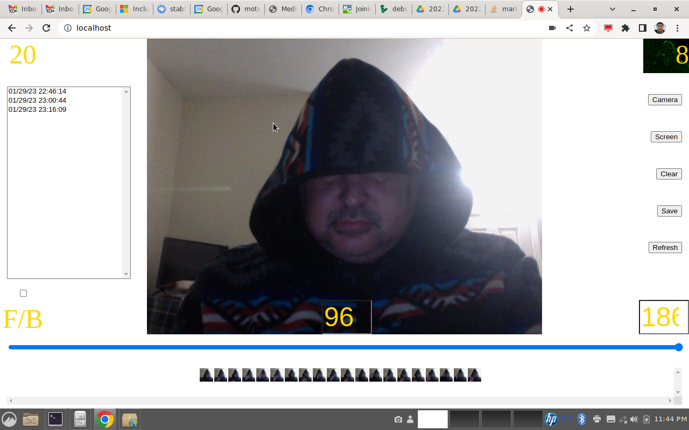

MotionCam by Mark Brito mark.brito@gmail.com, mark.duane.brito@gmail.com

Motion Camera that captures 100 frames at a time, cached on apache2 on localhost.

Note: If you don't have apache2 configured on localhost it clears the frames after 100 frames, as memory can only hold so many frames.

Read Documentation/ directory for vague setup instructions.

